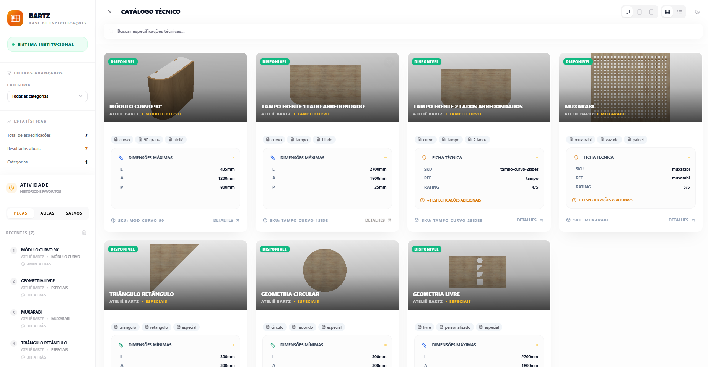
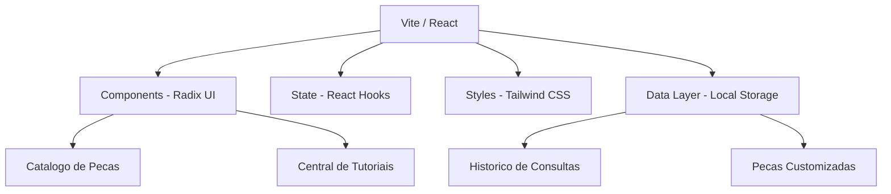
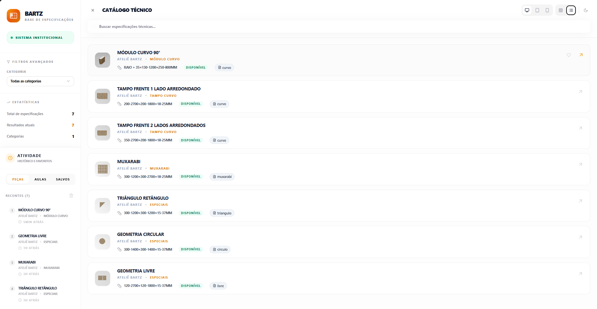
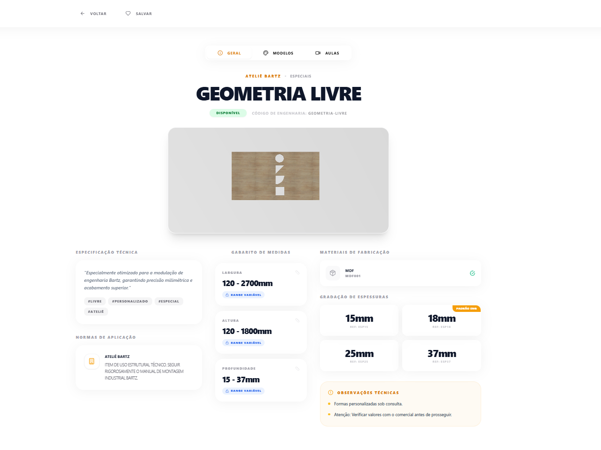
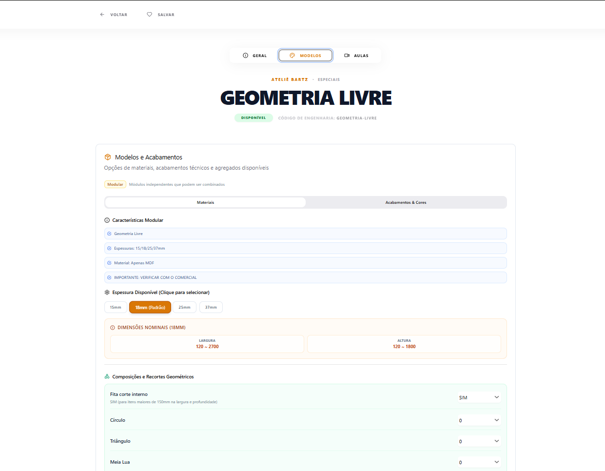
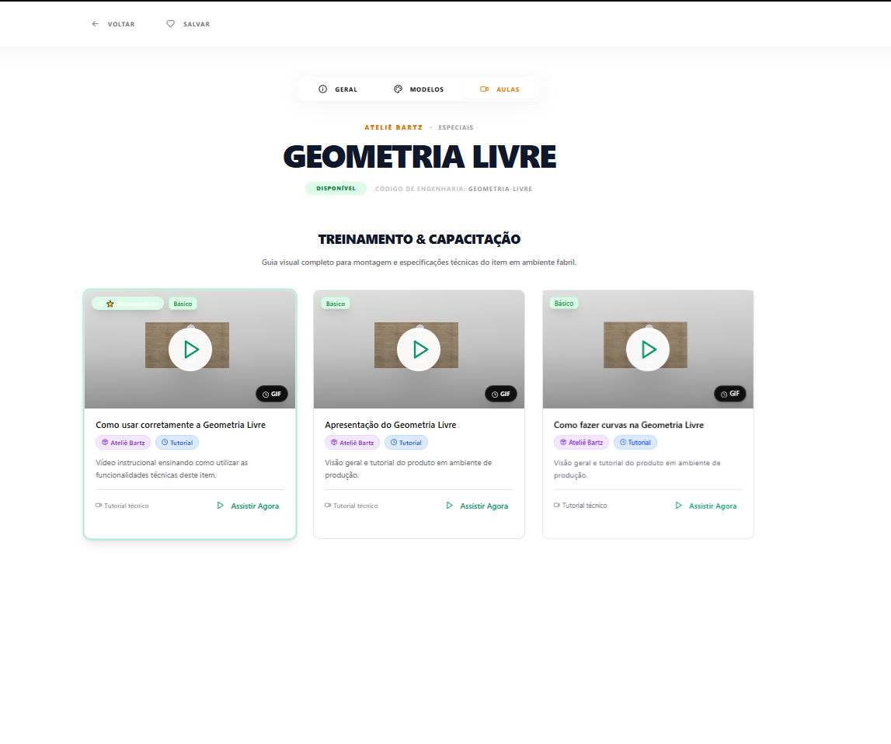

# Ateliê Bartz - Base de Especificações Técnicas

<div align="center">
  
</div>

<br />

Este sistema institucional moderno foi desenvolvido para fornecer um catálogo técnico completo, detalhado e interativo das peças e modulações de engenharia da **Ateliê Bartz**.

---

## 🎯 Objetivo + Problema

**Problema:** A equipe de montagem e engenharia muitas vezes enfrentava dificuldades para consultar as limitações técnicas e tutoriais de montagem de peças complexas "em campo", dependendo de manuais físicos ou consultas lentas.

**Objetivo:** Centralizar todo o conhecimento técnico de modulação em uma plataforma digital ultra-rápida, responsiva e offline-first, permitindo a consulta instantânea de medidas fixas/variáveis, acabamentos e vídeos de treinamento.

---

## 🏗️ Arquitetura

O projeto utiliza uma arquitetura moderna de Single Page Application (SPA) baseada em componentes.



---

## 🚀 Como Rodar

### Desenvolvimento
1. Certifique-se de ter o `Node.js` v20+ instalado.
2. Instale as dependências:
   ```bash
   npm install
   ```
3. Inicie o servidor:
   ```bash
   npm run dev
   ```

### Produção (Build)
Gere os arquivos estáticos para o diretório `dist/`:
```bash
npm run build
```

### Docker (Recomendado para Produção)
Suba o ambiente completo (Nginx + App) via Docker Compose:
```bash
docker-compose up --build
```
O sistema estará disponível em `http://localhost:8080`.

---

## 📡 Exemplos de Request/Response

*Como este projeto é um frontend puro com dados mockados, as interações acontecem via funções utilitárias que simulam requisições de API:*

**Busca de Peças:**
```typescript
// Chamada
const results = searchPieces("Muxarabi");

// Resposta (Exemplo)
[
  {
    id: "muxarabi",
    categoria: "Ateliê Bartz",
    descricao: "Muxarabi",
    tags: ["muxarabi", "vazado", "painel"],
    min: { largura: 300, altura: 300, profundidade: 18 }
  }
]
```

---

## 📸 Prints do Sistema

<div align="center">
  
  
  
  
</div>

---

## 🧪 Testes

O projeto conta com uma suíte de testes unitários utilizando **Vitest** para garantir a integridade dos dados e utilitários.

```bash
npm run test
```
*   **Catalog Logic:** Busca, filtros e gerenciamento de categorias.
*   **History Utils:** Formatação de datas e manipulação de histórico.

---

## ⚙️ GitHub Actions

Configurado para integração contínua (CI):
- **Lint:** Garantia de padrões de código.
- **Tests:** Execução automática da suíte Vitest.
- **Build:** Verificação de integridade da compilação.

---

> [!NOTE]
> Este programa foi desenvolvido com o auxílio de **Inteligência Artificial (Antigravity)** para otimização de arquitetura, implementação de CI/CD e refinamento de interface.

---
<p align="center">Construído com excelência técnica para a equipe Bartz.</p>
